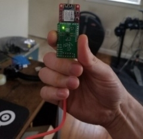

# Fall Detection with the MPLAB® ML Development Suite
|  |
| :--: |
| Deployed gesture recognizer |

## Repository Overview
This repository contains the firmware to classify a Fall activity detection on a SAMD21 Machine Learning Kit with the [Bosch BMI160 IMU](https://www.microchip.com/developmenttools/ProductDetails/EV45Y33A)
([Mikroe IMU2 click board](https://www.mikroe.com/6dof-imu-2-click)) or the [TDK ICM42688 IMU](https://www.microchip.com/DevelopmentTools/ProductDetails/PartNO/EV18H79A) ([Mikroe IMU14 click board](https://www.mikroe.com/6dof-imu-14-click)).

The supported activities are:

- *Fall Activity*
- *Normal Activity*
- *Idle*

In addition there is also an 'unknown' class for gesture-like movement and an 'idle' class for low motion activity.

## Continuous Gestures Dataset

The [Activity dataset](https://github.com/MicrochipTech/ml-Fall-Detection-SAMD21-IMU/tree/main/falldataset) was collected by Microchip employees and consists of two test subjects performing the fall activity as described in the section above with a [SAMD21 BMI160 evaluation board](https://www.microchip.com/developmenttools/ProductDetails/EV45Y33A). The dataset includes a collection of 10-second long samples in CSV format (ax,ay,az,gx,gy,gz format) split into training and test folds. 

In addition to the target activities, some additional gestures random activity signals  were collected to make up the *unknown* gestures class, which is used to help improve and validate the model's discriminatory ability.

Furthermore, the *idle* class data consists of scenarios where the device is fully at rest in different orientations and other scenarios with small motion activities that includes fidgeting with the board (manipulating the board randomly with the fingers) and pacing around the room while holding the board.

## Hardware Used
* SAMD21 Machine Learning Evaluation Kit with Bosch BMI160 IMU [(EV45Y33A)](https://www.microchip.com/developmenttools/ProductDetails/EV45Y33A)
* SAMD21 Machine Learning Evaluation Kit with TDK ICM42688 IMU [(EV18H79A)](https://www.microchip.com/developmenttools/ProductDetails/EV18H79A)

## Software Used
* [MPLAB® X IDE](https://microchip.com/mplab/mplab-x-ide)
* [MPLAB® XC32 Compiler](https://microchip.com/mplab/compilers)
* [MPLAB® Harmony 3](https://www.microchip.com/harmony)
* [MPLAB® ML Model Builder](https://onlinedocs.microchip.com/v2/keyword-lookup?keyword=MPLAB-ML-Documentation&redirect=true)

## Related Documentation
* ATSAMD21G18 [Product Family Page](https://www.microchip.com/wwwproducts/en/ATSAMD21G18)
* SAM-IoT WG Development Board [Product Details](https://www.microchip.com/developmenttools/ProductDetails/EV75S95A)
* MikroElektronika IMU Click Boards
   * [6DOF IMU 2 Click](https://www.mikroe.com/6dof-imu-2-click)
   * [6DOF IMU 14 Click](https://www.mikroe.com/6dof-imu-14-click)

# Firmware Operation
The firmware behavior can be summarized as operating in one of three distinct states as reflected by the onboard LEDs and described in the table below:

| State |	LED Behavior |	Description |
| --- | --- | --- |
| Error |	Red (ERROR) LED lit |	Fatal error. (Do you have the correct sensor plugged in?). |
| Buffer Overflow |	Yellow (DATA) and Red (ERROR) LED lit for 5 seconds	| Processing is not able to keep up with real-time; data buffer has been reset. |
| Running | Yellow (DATA) LED flashing slowly |	Firmware is running normally. |

In addition, the firmware also prints the classification output for each inference over the UART port. Connect to the COM port of the SAMD21 kit with the following settings:

- Baudrate 115200
- Data bits 8
- Stop bits 1
- Parity None

## Performing Gestures
Gestures should be performed in a way that feels natural, using a thumb and index finger grip around the SAMD21 board as shown in the image below. The top of the board should be facing away from the user, with the USB connector oriented towards the ground.

|  |
| :--: |
| Thumb and index finger grip |

## Firmware Benchmark
Measured with the ICM42688 sensor configuration, ``-O2`` level compiler optimizations, and 48MHz clock
- 38.2kB Flash
- 9.1kB RAM
- 16ms Inference time

## Classifier Performance
Below is the confusion matrix for the test dataset. Note that the classes are imbalanced so accuracy is not a good indicator of overall performance.

# Sensor Configuration
Binary builds of the data logging firmware used in the data collection for this project can be found in the [binaries](https://github.com/MicrochipTech/ml-samd21-iot-mplabml-gestures-demo/tree/main/binaries) folder of this repo; see the [ml-samd21-iot-imu-data-logger](https://github.com/MicrochipTech/ml-samd21-iot-imu-data-logger) repository to build data logging firmware with different sensor configurations.

Sensor configuration values used in the data collection are summarized in the table below.

| IMU Sensor | Axes | Sampling Rate | Accelerometer Range | Gyrometer Range |
| --- | --- | --- | --- | --- |
| Bosch BMI160 | Ax, Ay, Az, Gx, Gy, Gz | 100Hz | 16G | 2000DPS |
